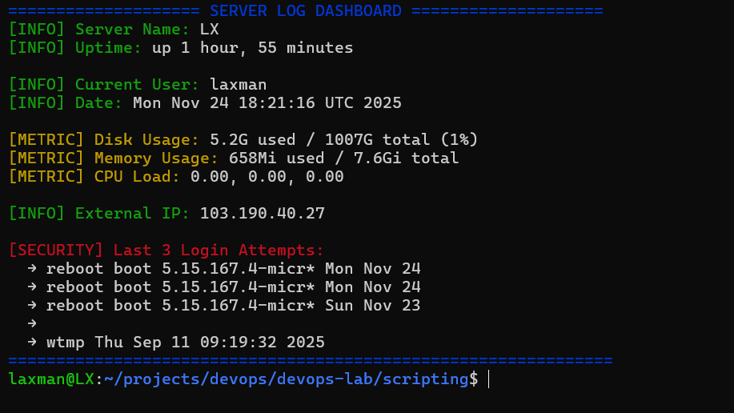

# Weekend Assignment

Task 1 : Create a bash script that shows everything at [onceserver-dashboard.sh](http://onceserver-dashboard.sh/)

- clears screen and shows in color:
- Server name & uptime
- Current user & date
- Disk, memory & CPU usage
- Your external IP
- Last 3 login attempts

# **Task 1 — Server Dashboard**

**Purpose:** Show a **colorful, log-style dashboard** with server info, metrics, external IP, and recent login attempts.

---

## **Script Breakdown**

### **Step 0 — Colors**

```bash
GREEN="\e[32m"
BLUE="\e[34m"
YELLOW="\e[33m"
RED="\e[31m"
RESET="\e[0m"

```

- ANSI escape codes for colored output.
- `RESET` resets terminal to default color.

---

### **Step 1 — Gather Server Info**

```bash
IP=$(curl -s ifconfig.me)

```

- Fetches the **external/public IP** from `ifconfig.me`.
- `s` → silent mode (no progress output).

```bash
LAST_LOGINS=$(last -n 3 | awk '{print $1" "$3" "$4" "$5" "$6" "$7}')

```

- Uses `last -n 3` → lists the last **3 login attempts**.
- `awk '{print $1" "$3" "$4" "$5" "$6" "$7}'` → formats each line to show:
    - `$1` = username
    - `$3` to `$7` = tty, IP/host, date, time, duration

```bash
SERVER=$(hostname)
UPTIME_INFO=$(uptime -p)
USER_NOW=$(whoami)
DATE_NOW=$(date)
DISK=$(df -h / | awk 'NR==2 {print $3" used / "$2" total ("$5")"}')
MEMORY=$(free -h | awk '/Mem/ {print $3" used / "$2" total"}')
CPU_LOAD=$(top -bn1 | grep "Cpu(s)" | awk '{print $(NF-2)" "$(NF-1)" "$NF}')

```

- `hostname` → server name.
- `uptime -p` → pretty uptime (e.g., "up 3 days, 4 hours").
- `whoami` → current user.
- `date` → current date & time.
- `df -h /` → disk usage of root (`/`), `awk` formats used/total/percent.
- `free -h` → memory usage, `awk` formats used/total.
- `top -bn1` → CPU stats in batch mode, `awk` prints the last fields (user/system/idle).

---

### **Step 2 — Print Dashboard Header (with `awk`)**

```bash
awk -v g="$GREEN" -v b="$BLUE" -v y="$YELLOW" -v r="$RED" -v reset="$RESET" \
    -v server="$SERVER" \
    -v uptime="$UPTIME_INFO" \
    -v user="$USER_NOW" \
    -v date="$DATE_NOW" \
    -v disk="$DISK" \
    -v memory="$MEMORY" \
    -v cpu="$CPU_LOAD" \
    -v ip="$IP" \
    'BEGIN {
        print b "==================== SERVER LOG DASHBOARD ====================" reset;
        print g "[INFO] Server Name: " reset server;
        print g "[INFO] Uptime: " reset uptime "\n";

        print g "[INFO] Current User: " reset user;
        print g "[INFO] Date: " reset date "\n";

        print y "[METRIC] Disk Usage: " reset disk;
        print y "[METRIC] Memory Usage: " reset memory;
        print y "[METRIC] CPU Load: " reset cpu "\n";

        print g "[INFO] External IP: " reset ip "\n";

        print r "[SECURITY] Last 3 Login Attempts:" reset;
    }'

```

- Uses `awk` **only for formatting** and coloring output.
- `v` passes **shell variables into awk**.
- `BEGIN { ... }` → executes **before reading any input**.
- Prints:
    - Dashboard header (`BLUE`)
    - Server info (`GREEN`)
    - Metrics (`YELLOW`)
    - External IP (`GREEN`)
    - Last 3 logins header (`RED`)

---

### **Step 3 — Print Last 3 Logins (formatted)**

```bash
last -n 3 | awk '{print "  → " $0}'

```

- Runs `last -n 3` again (to print full login line).
- `awk '{print " → " $0}'` → prepends an arrow to each line for better readability.

result screenshot: 

