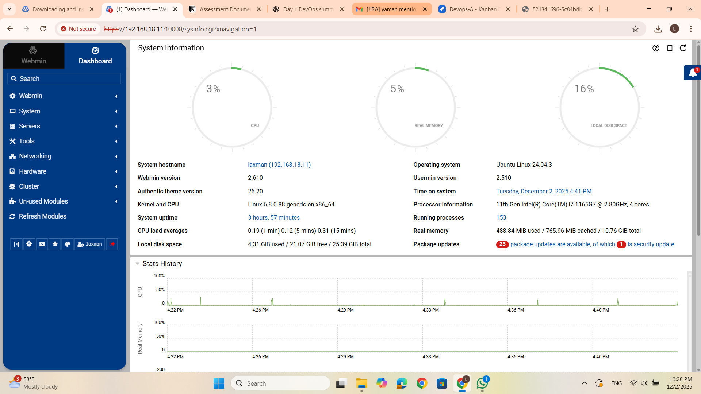

# Assessment Documentation: Setup Ubuntu Server VM & Install Webmin

## **1. Objective**

The purpose of this assessment is to install and configure **Webmin** on an Ubuntu Server running inside a Virtual Machine (VM), and then access the Webmin web interface from a host machine.

---

# **2. Requirements**

### **Hardware / Software Needed**

- A computer capable of running virtualization
- Virtualization Platform (any one):
    - VMware Workstation / Player
    - VirtualBox
    - Hyper-V
- Ubuntu Server ISO
- Stable internet connection

---

# **3. Steps**

---

## **Step 1: Create and Run Ubuntu Server in a VM**

1. Download **Ubuntu Server ISO** from the official website.
2. Open your virtualization software and create a **new virtual machine**.
3. Allocate:
    - CPU: 2 cores
    - RAM: 2–4GB
    - Storage: 20GB+
4. Mount the Ubuntu Server ISO.
5. Start the VM and follow installation steps:
    - Select language
    - Configure keyboard
    - Choose normal installation
    - Enable OpenSSH Server (recommended)
    - Create user account
6. Complete the installation and reboot the VM.

---

## **Step 2: Update the Server**

After login into the Ubuntu server VM:

```bash
sudo apt update && sudo apt upgrade -y
```

---

## **Step 3: Install Webmin**

### **3.1 Download Webmin Repo Setup Script**

Run:

```bash
curl -o webmin-setup-repo.sh https://raw.githubusercontent.com/webmin/webmin/master/webmin-setup-repo.sh
```

### **3.2 Run the Setup Script**

```bash
sudo sh webmin-setup-repo.sh
```

This script adds the Webmin repository and imports the GPG key.

### **3.3 Install Webmin**

```bash
sudo apt-get install webmin --install-recommends -y
```

---

## **Step 4: Verify Webmin Service**

```bash
sudo systemctl status webmin
```

Expected: **active (running)**

If not running:

```bash
sudo systemctl restart webmin
```

---

---

## **Step 5: Access Webmin from Browser**

### **Find VM IP Address**

```bash
hostname -I

```

Example: `192.168.1.80`

### **Open Browser on Host Machine**

Go to:

```
https://<VM-IP>:10000

```

Example:

```
https://192.168.1.80:10000

```

If security warning appears → click **Advanced → Proceed**.

screenshot of dashboard :



### **Login**

Use your **Ubuntu server username and password**.

---

# **6. Conclusion**

This assessment successfully demonstrates:

✔ Installation of Ubuntu Server in a VM

✔ Installation of Webmin using official repository script

✔ Running and accessing Webmin web interface on port **10000**

✔ System administration through graphical Webmin panel