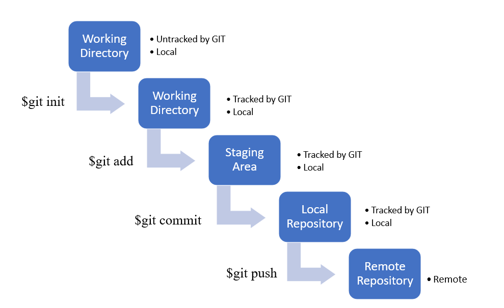

# Day 8 – DevOps Bootcamp Log

Today’s session was fully focused on understanding the **Git Lifecycle**, branching concepts, merging, and how environments work in a Git-based workflow. This helped me understand how teams manage code in a clean and structured way.

## **Git Lifecycle**



---

## **1. “Who, What, When”**

I learned how Git tracks everything:

- **Who** made the change
- **What** was changed
- **When** the change happened

Every commit in Git is uniquely identified using a **commit hash**.

This hash acts like a fingerprint that helps trace changes throughout the project’s history.

---

## **2. Branching – Why It Exists**

The main idea of branching is to make development clean and risk-free.

Key reasons for branching:

- **Isolate feature development**
  Each feature gets its own branch so it doesn't break the main code.
- **Easy to revert changes**
  If something goes wrong, only that branch is affected.
- **Reduce overwriting changes**
  Developers don’t step on each other's work.
- **Cleaner workflow**
  Different tasks → different branches.

### **Important point I learned:**

> Even if a project uses multiple branches, the branching strategy must remain linear or must be made linear when merging into the main branch.
>
> This keeps history clean and prevents complicated merges.

---

## **3. Merging & Pull Requests (PR)**

I explored how changes come back into the main branch.

### **Git Merge**

Used to combine a branch into another:

```bash
git checkout main
git merge feature-login
```

### **Pull Requests**

- A Pull Request is basically _“I want to merge my branch – please review it.”_
- Helps maintain code quality through review and approval.

---

## **4. Merge Conflicts & Resolution**

I learned why merge conflicts happen:

- When two branches modify the same part of a file.

Resolving conflicts involves:

1. Opening the file
2. Fixing the `<<<<`, `====`, `>>>>` sections
3. Adding the file back
4. Making a new commit

This is a normal part of teamwork in Git.

---

## **5. Environments in Git**


One interesting concept today was understanding **environments**.

Environments vary depending on how a team works.

Example environments:

- **Development**
- **Testing / QA**
- **Staging**
- **Production**

Teams often map Git branches to environments like:

- `dev` → development
- `stage` → staging
- `main` → production

This helps push code step-by-step instead of directly deploying to production.

---

# **Summary**

Today’s learning helped me understand the complete flow of Git, Git lifecycle and its commit tracking. The purpose of branching concept and it pattern of creation. Topics discussion on Merging, pull requests and merge conflicts as well as different environment or workspace helped me understood how git support all these. Overall, it clarified how professional teams maintain clean and stable code.
