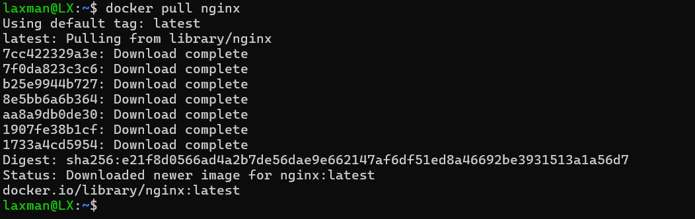

# Day 12 – Docker Basics & Working With Nginx Image

### **Topics Learned**

- Core concepts of **Docker**, including images and containers
- Pulling and managing images
- Running containers and exposing ports
- Basic Docker commands for container and image management

---

## **Practical Tasks Performed**

### **1. Pulled Nginx Image**

```bash
docker pull nginx
```



### **2. Run Nginx Container**

```bash
docker run -d -p 8080:80 nginx

```


- Viewed the Nginx welcome page via curl.


### **3. Checked Running Containers**

```bash
docker ps
```


### **4. Checked All Containers (including stopped)**

```bash
docker ps -a
```

### **5. Stopped a Running Container**

```bash
docker stop <container_id>

```

### **6. Removed a Stopped Container**

```bash
docker rm <container_id>

```

### **7. Listed Downloaded Images**

```bash
docker images

```


### **8. Removed an Image**

```bash
docker rmi nginx

```

### **9. Removed All Containers (force)**

```bash
docker rm -f $(docker ps -aq)

```

### **10. Removed All Images**

```bash
docker rmi -f $(docker images -q)

```

---

## **Learnings**

- Understood how images act as templates for creating containers.
- Learned to run containers in detached mode with `d`.
- Practiced port mapping using `p host_port:container_port`.
- Differentiated between stopping a container vs removing it.
- Learned common commands that are essential for daily Docker usage.

---

## **Summary**

Day 12 provided a strong foundation in Docker basics. I pulled and ran the Nginx image and practiced essential Docker commands for listing, stopping, removing containers and images. This session increased my confidence in managing Dockerized applications.

```

```
