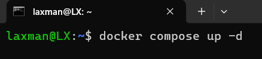

# Day-14 - Assessment

**Create your own Docker image that runs a Portfolio website with at least 2 images and a button to download your CV**

## **1. Creating My Portfolio**

You can start by creating a portfolio website using different tech stack. For this project, I will be using react js, typescript, tailwindcss. d

## **2. Creating Dockerfile**

```docker
FROM node:22-alpine AS builder

WORKDIR /app

COPY package.json package-lock.json ./

RUN npm ci

COPY . .

RUN npm run build

FROM nginx:1.29

# Remove default nginx html files
RUN rm -rf /usr/share/nginx/html/*

COPY --from=builder /app/dist /usr/share/nginx/html

EXPOSE 80

I created a docker file to build the application image in which node and nginx
images are used. Node image for running application for runtime environment whereas
Nginx image for hosting the react application that consist my portfolio website.

```

## **3. Creating Docker Compose (Optional)**

For this, docker compose is optional because we can make and run container only with the Dockerfile.

```
services:
  project-portfolio:
    build: .
    container_name: portfolio
    ports:
      - "8080:80"
    restart: always
```

here, the compose file is pointing the same dockerfile created before and exposing it in port 8080 with the container name portfolio.

## **4. Run Docker file or Docker Compose**

If you have created docker compose file, use this command which will build the image from the current context and run the container.



If you have created dockerfile only, then use these commands:


After this:


## **5.  Viewing in the browser**

Now, the website will be available in the browser at port 8080


### **What I Learned from This Project**

- How Docker images and containers work in a real project.
- How to use **docker-compose** to simplify building and running containers.
- How to expose ports and access the website from the browser.
- How to package and deploy any web app in a clean way.