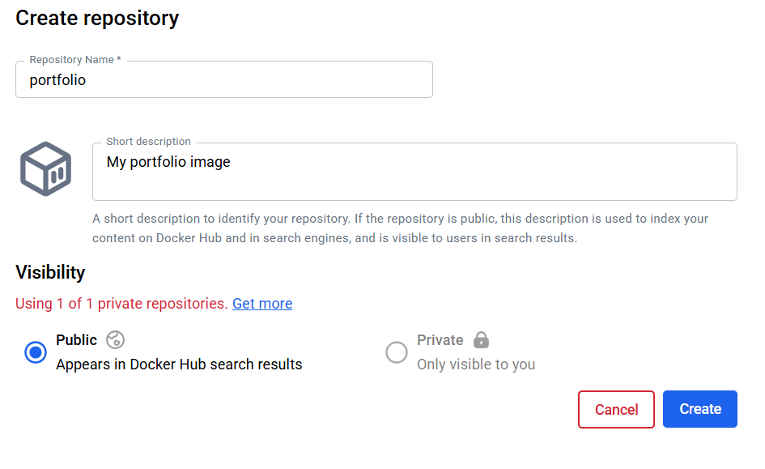

# Day-15 - Assessment

Push portfolio docker image to the docker hub. 

## Step 1: Create an image repository in docker hub



You will find this page after you click  “Create” button


## Step 2: Build the image that you want to push to the repository with this command


## Step 3: **Tag the Image for Docker Hub**

Used the required naming convention:

`dockerhub-username/repository:tag`


## Step 4: Push the docker image to docker hub


This uploaded all image layers to the remote registry.

---

## **Result**

- The **portfolio image** is successfully published on Docker Hub.
- It can now be pulled on any machine using:
    
    ```bash
    docker pull laxmanshr2003/portfolio:v1
    
    ```