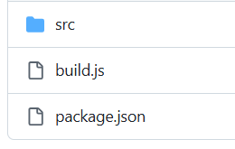

# Day-16- Assessment

# **Containerize NodeJS App with Multi Stage Docker Build**

Project for containerizing:



            The project is aimed to learn multi stage docker build in which we will work on multiple images on same docker file. 

         In this project, when the image is build, the App_Version is updated every time.

**code of build.js**


           The above build.js code builds the html file when it runs and ensures to show image or app metadata like date and version in index.html file. 

**code of src/template.html**


                          The above template.html contains the template written in html code which is used by build.js function.

**code of package.json**


                               The above package.json file contains the metadata of application and dependencies which are required to build the project in new environement. 

### Step 1: First of all, Go to the current directory of the project and run this command. This will install the project dependencies.

This cmd will install all the dependencies which are listed in package.json file.


### Step 2: Create an .env file

           The code requires .env file as it is expecting to get version from the environment file to provide the version in the html file. 


### Step 3: Create an version incremental function

                    Now, create a function to increment App_version every time when the image is build to track the image version. 


### Step 4: Run this function in the npm script execution time.

                 Add execution script in the package.json file so that when the docker file execute the RUN command 

let the  update-version.js file also be run so that it can increment the version of the app or image.


### Step 5: Create a dockerfile

          The below docker file is written in multi stage docker file pattern. here, “AS” helps to make alias for any variable like builder here. We can then retrieve the last output of the image in this alias which is very used in upcomming image as input. 

          Here, the output which is a dist/index.html folder is output of previous docker image and that is used as input for the nginx to host that file.

```docker
FROM node:22-alpine AS builder
WORKDIR /app
COPY package*.json ./
RUN mkdir -p dist && npm install
COPY . .
RUN npm run build

FROM nginx:alpine
COPY --from=builder /app/dist/index.html /usr/share/nginx/html/
EXPOSE 80

```

### Step 6: Build the image with this docker file

After the successful written of Multi Stage Dockerfile, build the image for the docker file.


### Step 7: Run the container

Now, run the built image to run and test the container if the version is showing as intended or not.


### Step 8 : Result

We can test the result through browser as well as curl command. 

http://localhost:8090


Finally, the javascript application is containarized with multi stage build and ran successfully.