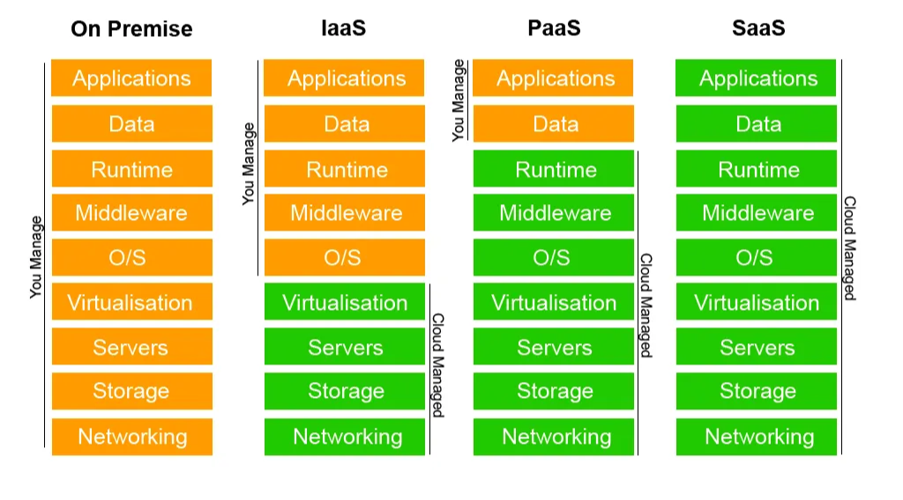

# Day 18 – Cloud Service Models & Modern Cloud Concepts

Today, I learned different cloud computing models and how responsibilities are divided between the cloud provider and the customer. I also explored modern cloud-native services that are widely used in DevOps and backend development.

---

## **1. Cloud Service Models (IaaS, PaaS, SaaS)**

I reviewed the three major cloud service delivery models:

- **IaaS (Infrastructure as a Service)**
    
    Provides virtual machines, storage, and networking. The user controls the OS, applications, and runtime. Example: AWS EC2.
    
- **PaaS (Platform as a Service)**
    
    Offers a fully managed development platform. Users focus only on writing and deploying code. Example: AWS Elastic Beanstalk.
    
- **SaaS (Software as a Service)**
    
    Applications are delivered fully over the internet with no infrastructure management. Example: Gmail, Salesforce.
    

---

## **2. Shared Responsibility Model**

I revised how cloud providers and users share security and operational responsibilities:

- **Cloud Provider Handles:**
    
    Physical security, hardware, networking, hypervisor, and managed services.
    
- **Customer Handles:**
    
    Data security, user access, application logic, and configurations (varies depending on IaaS/PaaS/SaaS).
    

Understanding this model is essential for deploying secure and compliant cloud applications.

---

## **3. Cloud-Native Services and Automation Concepts**

Today I also learned about newer cloud service concepts that help modernize application deployment:

- **Auto-Provisioning**
    
    Automatically creating or scaling resources based on real-time demand.
    
- **CaaS (Container as a Service)**
    
    Managed container orchestration platforms like Kubernetes, ECS, EKS.
    
- **FaaS (Function as a Service)**
    
    Also known as *serverless*. Functions run only when triggered, reducing cost and operational overhead. Example: AWS Lambda.
    

[Day-18 -Assessment](https://www.notion.so/Day-18-Assessment-2c583ce988fa80a9ab6bd3b402f8c1d0?pvs=21)