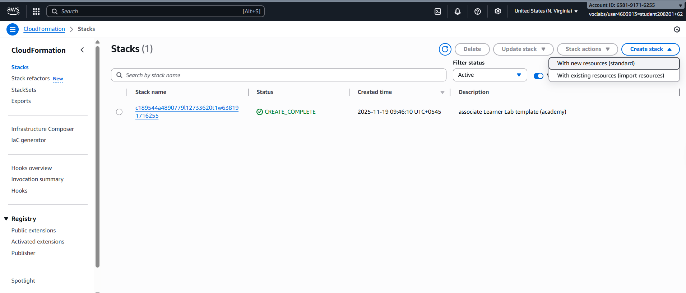

# Day-20-Assessment

# Deploy and Document an EC2 Instance using AWS CloudFormation

This document explains how to deploy an EC2 instance using AWS CloudFormation and how to document the infrastructure in a clear, DevOps-friendly way.

---

## 1. Prerequisites

Before deploying, ensure you have:

- An **AWS account**
- An **existing EC2 Key Pair** (for SSH access)
- AWS CLI installed (optional, but recommended)
- IAM permissions for EC2, VPC, and CloudFormation

Optional but useful:

- WSL / Linux terminal
- Basic understanding of YAML

---

## 2. Architecture Overview

The CloudFormation template provisions the following resources:

- VPC
- Public Subnet
- Internet Gateway
- Route Table and Route
- Security Group (SSH + HTTP)
- EC2 Instance (Amazon Linux / Ubuntu)
- Elastic IP

**Flow:**

VPC → Subnet → Internet Gateway → Route Table → EC2 → Elastic IP

---

## 3. CloudFormation Template (EC2 Deployment)

```yaml
AWSTemplateFormatVersion: "2010-09-09"
Description: A CloudFormation template for creating VPC, Subnets, and Security Groups, along with an EC2 instance and elastic IP

Parameters:
  KeyPair:
    Type: AWS::EC2::KeyPair::KeyName
    Description: Choose an existing keypair

Resources: 
  MyEC2VPC:
    Type: AWS::EC2::VPC
    Properties:
      CidrBlock: 10.0.0.0/16
      EnableDnsSupport: true
      EnableDnsHostnames: true
      Tags:
        - Key: Name
          Value: LabVPC
  
  Subnet:
    Type: AWS::EC2::Subnet
    Properties:
      VpcId: !Ref MyEC2VPC
      CidrBlock: 10.0.1.0/24
      AvailabilityZone: us-east-1a
      Tags:
        - Key: Name
          Value: PublicSubnet

  InternetGateway:
    Type: AWS::EC2::InternetGateway
    Properties: 
      Tags:
        - Key: Name
          Value: EC2InternetGateway

  VpcGatewayAttachment:
    Type: AWS::EC2::VPCGatewayAttachment
    Properties: 
      VpcId: !Ref MyEC2VPC
      InternetGatewayId: !Ref InternetGateway
      

  RouteTable:
    Type: AWS::EC2::RouteTable
    Properties:
      VpcId: !Ref MyEC2VPC
      Tags:
        - Key: Name
          Value: MyEC2VPC-RouteTable

  Route:
    Type: AWS::EC2::Route
    Properties: 
      RouteTableId: !Ref RouteTable
      DestinationCidrBlock: 0.0.0.0/0
      GatewayId: !Ref InternetGateway
   
  SubnetRouteTableAssociation:
    Type: AWS::EC2::SubnetRouteTableAssociation
    Properties: 
      RouteTableId: !Ref RouteTable
      SubnetId: !Ref Subnet

  SecurityGroup:
    Type: AWS::EC2::SecurityGroup
    Properties: 
      GroupDescription: Enable SSH and HTTP access
      VpcId: !Ref MyEC2VPC
      SecurityGroupIngress:
        - IpProtocol: tcp
          FromPort: 22
          ToPort: 22
          CidrIp: 0.0.0.0/0
        - IpProtocol: tcp
          FromPort: 80
          ToPort: 80
          CidrIp: 0.0.0.0/0
      Tags:
        - Key: Name
          Value: LabSecurityGroup

  LaxmanEC2:
    Type: AWS::EC2::Instance
    Properties:
      Tags:
        - Key: Name
          Value: LabEC2
      ImageId: ami-084568db4383264d4
      InstanceType: t3.micro
      KeyName: !Ref KeyPair
      SubnetId: !Ref Subnet
      SecurityGroupIds: 
        - !Ref SecurityGroup
      BlockDeviceMappings:
        - DeviceName: /dev/sda1
          Ebs:
            VolumeType: gp2
            VolumeSize: 20
            DeleteOnTermination: true
    
      DisableApiTermination: false
      UserData:
        Fn::Base64: |
          #!/bin/bash
          apt update -y
          apt install nginx -y
          systemctl start nginx
          systemctl enable nginx
        
          echo "<h1>Welcome to Laxman EC2 instance </h1>" > /var/www/html/index.html

  ElasticIp:
    Type: AWS::EC2::EIP
    Description: This elastic ip is attaced with MyEC2VPC
    Properties:
      Domain: vpc
      InstanceId: !Ref LaxmanEC2
      Tags:
        - Key: Name
          Value: LabElasticIp

Outputs:
  ElasticIpPublicIp:
    Value: !GetAtt ElasticIp.PublicIp
    Description: The Public IP address associated with the Elastic IP address.
  EC2PublicIp:
    Value: !GetAtt LaxmanEC2.PublicIp
    Description: The Public IP address of LaxmanEC2
  PublicDnsName:
    Value: !GetAtt LaxmanEC2.PublicDnsName
    Description: The Public DNS name of LaxmanEC2 instance

  
```

---

Result

## 4. Deployment Methods

### Option A: AWS Management Console

1. Go to **CloudFormation → Create Stack —> choose “With new resources (standard)”**



1. Upload the YAML template


1. Enter KeyPair name


1. Click **Create Stack**
2. Result

Now, look at results below, EC2 instance is successfully running.


---


Result from EC2, Nginx service.


### Option B: AWS CLI (Recommended)

Step 1: First validate cloudformation template file using below command


```jsx
aws cloudformation validate-template --template-body file://<fileName.yaml>
```

Step 2: Now, list the keypairs created in AWS, If there is no any key pair , first key pair should be created.


aws ec2 describe-key-pairs --query "KeyPairs[].KeyName"

Step 3: After this, we can deploy of .yaml file successfully using below command


```jsx
aws cloudformation deploy \
  --template-file ec2.yaml \
  --stack-name ec2-lab \
  --capabilities CAPABILITY_NAMED_IAM
```

To see the stack, view details of the stack using below command

aws cloudformation describe-stacks \
--stack-name <stack-name.yml>

### **Result**


We should validate before deploy:

---

## 5. Verification Steps

- Check **EC2 → Instances** (running)
- Check **Elastic IP** attached
- Visit: `http://<Elastic-IP>` → Nginx welcome page
- SSH:

```bash
ssh -i key.pem ubuntu@<Elastic-IP>

```

---

---

## Common Errors & Fixes

| Error | Cause | Fix |
| --- | --- | --- |
| Unrecognized resource type | Wrong CFN name | Use exact AWS types |
| GroupDescription missing | Wrong SG field | Use GroupDescription |
| KeyPair error | Wrong EC2 property | Use KeyName |

---

## 8. Conclusion

This CloudFormation stack demonstrates **Infrastructure as Code (IaC)** by provisioning a complete EC2 environment in a repeatable, automated, and auditable manner.

---